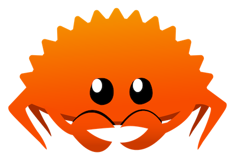

## Hi, Chandram Here!

This repo consists of my learning about rust. I have used _"The Rust Book"_ mostly for the learning but as it grows and I learn new things, you could find resources and codes from several places and some of my original code.

> **Note**
> Feel free to PR if you think something is wrong or not a good way.

> **Warning**
> The code in this might not always be accurate or the best version so don't trust all of 'em. It's all about exploring and experimenting and most importantly, learning. Peace✌️!

### BTW MEET FERRIS 👇👇!!!

